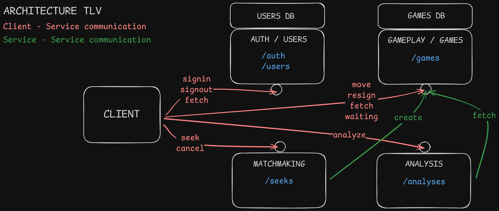

# Checkm8

Checkm8 is an application that allows users to play chess with players with similar skill and request deep analysis of their games (can be imported) with different chess engines.

## Architecture

It uses microservice architecture.

### Microservices



- **Auth/Users**
    - ```/auth```: Signin, Signup
    - ```/users```: Fetch account/accounts
- **Matchmaking**
    - ```/seeks```: Seek, Cancel
- **Gameplay/Games**
    - ```/games```: Create, Join, Move, Resign, Fetch games, Waiting
- **Analysis**
    - ```/analyses```: Analyze

### Communcation

- **Client -> Auth/Users**
    - *Actions*: Signin, Signup, Account, Fetch account/accounts
- **Client -> Matchmaking**
    - *Actions*: Seek, Cancel
- **Matchmaking -> Gameplay/Games**
    - *Actions*: Create
- **Client -> Gameplay/Games**
    - *Actions*: Move, Resign, Fetch games, Waiting
- **Client -> Analysis**
    - *Actions*: Analyze
- **Analysis -> Gameplay/Games**
    - *Actions*: Fetch games

### DBs
- **Auth/Users -> UsersDB**
- **Gameplay/Games -> GamesDB**
