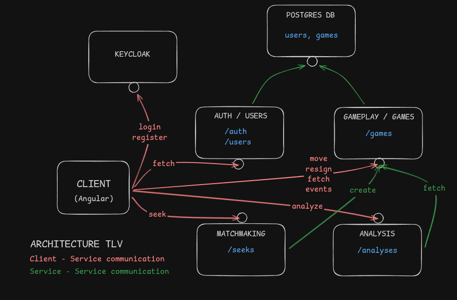

# Checkm8

Checkm8 is an application that allows users to play chess with players with similar skill and request deep analysis of their games (can be imported) with different chess engines.

## Architecture

It uses microservice architecture.

### Microservices



- **Auth/Users**
    - ```/auth```: Signin, Signup
    - ```/users```: Fetch account/accounts
- **Matchmaking**
    - ```/seeks```: Seek, Cancel
- **Gameplay/Games**
    - ```/games```: Create, Join, Move, Resign, Fetch games, Waiting
- **Analysis**
    - ```/analyses```: Analyze

### Communcation

- **Client -> Auth/Users**
    - *Actions*: Signin, Signup, Account, Fetch account/accounts
- **Client -> Matchmaking**
    - *Actions*: Seek, Cancel
- **Matchmaking -> Gameplay/Games**
    - *Actions*: Create
- **Client -> Gameplay/Games**
    - *Actions*: Move, Resign, Fetch games, Waiting
- **Client -> Analysis**
    - *Actions*: Analyze
- **Analysis -> Gameplay/Games**
    - *Actions*: Fetch games

### DBs
- **Auth/Users -> UsersDB**
- **Gameplay/Games -> GamesDB**
- create with:
    - ```docker build . -t checkm8-postgres```
    - ```docker create --name checkm8-db -p 5432:5432 checkm8-postgres```
- start with: ```docker start checkm8-db```

## CHECKLIST QUEUE
[checklist_q.md](./readme_assets/checklist_q.md)

## USE WITH docker-compose locally
- ```docker run -p 127.0.0.1:8083:8080 -e KC_BOOTSTRAP_ADMIN_USERNAME=admin -e KC_BOOTSTRAP_ADMIN_PASSWORD=admin --name checkm8_keycloak quay.io/keycloak/keycloak start-dev``` for keycloak + set it up
- ```docker start checm8-db``` for db
- connect db and keycloak to network with: ```docker network connect checkm8-network checkm8_keycloak```
- ```docker compose start``` for microservices
